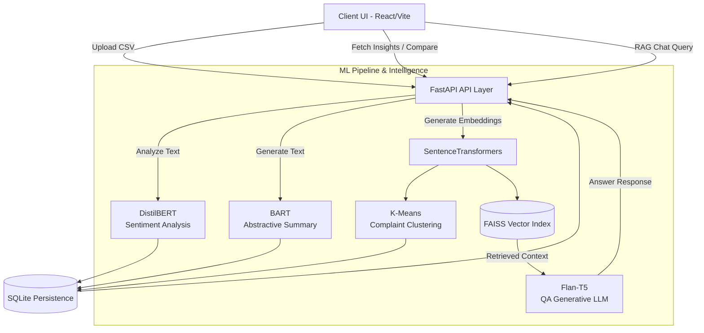

<div align="center">
  
  
  # ProductIQ
  **AI-Powered E-Commerce Review Intelligence Platform**
  
  ProductIQ is a production-grade SaaS application designed to help both customers and businesses instantly analyze thousands of product reviews. Instead of scrolling through hundreds of comments manually, ProductIQ uses cutting-edge NLP to summarize sentiments, extract key pros and cons, cluster common complaints, and power a state-of-the-art **Retrieval-Augmented Generation (RAG) Chatbot** to let you chat directly with the data.

  [](https://fastapi.tiangolo.com/)
  [](https://reactjs.org/)
  [](https://tailwindcss.com/)
  [](https://huggingface.co/)
</div>

<br />

## 🎥 Demo

🎥 **Demo Video:** https://youtu.be/rKsaeA0NfXQ

Watch ProductIQ instantly analyze and compare product reviews using AI-powered sentiment analysis, review summarization, complaint clustering, and RAG-based question answering.

---


## ✨ Features

- **📊 Comprehensive Dashboard**: Instant visual breakdown of overall sentiment scores, total reviews, and automatically extracted top Pros & Cons.
- **🤖 AI Review Summaries**: Uses `distilbart-cnn` to read hundreds of reviews and generate a concise, human-readable summary paragraph.
- **🛑 Complaint Clustering**: Uses SentenceTransformers and K-Means clustering to map out common issues (e.g., grouping "heating issues" and "phone gets hot").
- **💬 Review Assistant (RAG)**: A dedicated Chat tab powered by `Flan-T5` and `FAISS` vector search. Ask it "Does this phone overheat?" and get answers based strictly on real customer data.
- **🕵️ Fake Review Detection**: Built-in heuristics that flag potentially suspicious or spammy reviews based on conflicting sentiment-rating ratios and keyword matching.
- **⚖️ Product Comparison**: Upload datasets for Product A and Product B to get a side-by-side battle of their key metrics and sentiments.

---

## 🏗️ Architecture

ProductIQ uses a decoupled architecture. The frontend handles state and visualizations using React & Recharts, while the FastAPI backend acts as an orchestrator for the local Machine Learning pipeline.



---

## 🚀 Tech Stack

### Frontend
* **Vite + React (TypeScript)**
* **Tailwind CSS v4** for modern, responsive styling
* **Lucide React** for beautiful icons
* **Recharts** for interactive data visualizations
* **Axios** for API integration

### Backend & Machine Learning
* **FastAPI** for high-performance REST APIs
* **SQLAlchemy & SQLite** for local persistence
* **Hugging Face Transformers** for local NLP processing (`distilbert`, `bart`, `flan-t5`)
* **FAISS (Facebook AI Similarity Search)** for high-speed RAG vector lookups
* **Scikit-Learn** for K-Means clustering

---

## 🛠️ Setup & Installation

Follow these instructions to run the application locally. Make sure you have Node.js and Python 3.10+ installed.

### 1. Start the Backend

Navigate to the `backend` folder, set up your virtual environment, install the ML dependencies, and start the Uvicorn server.

```bash
cd backend
python -m venv venv
.\venv\Scripts\activate   # Or source venv/bin/activate on Mac/Linux
pip install -r requirements.txt
pip install faiss-cpu

uvicorn app.main:app --host 0.0.0.0 --port 8000
```
> **Note**: The first time you start the backend, it will take a few minutes to download the Hugging Face models (BART, DistilBERT, Flan-T5) to your local cache.

### 2. Start the Frontend

In a new terminal window, navigate to the `frontend` directory, install Node packages, and run the Vite dev server.

```bash
cd frontend
npm install
npm run dev
```

### 3. Usage

1. Open your browser and navigate to `http://localhost:5173`.
2. Go to the **Data Ingestion** tab.
3. Upload your `.csv` file. *(The CSV must contain a `review` column, and optionally a `rating` and `date` column).*
4. Once processed, explore the **Dashboard** and start chatting with the **Review Assistant**.
